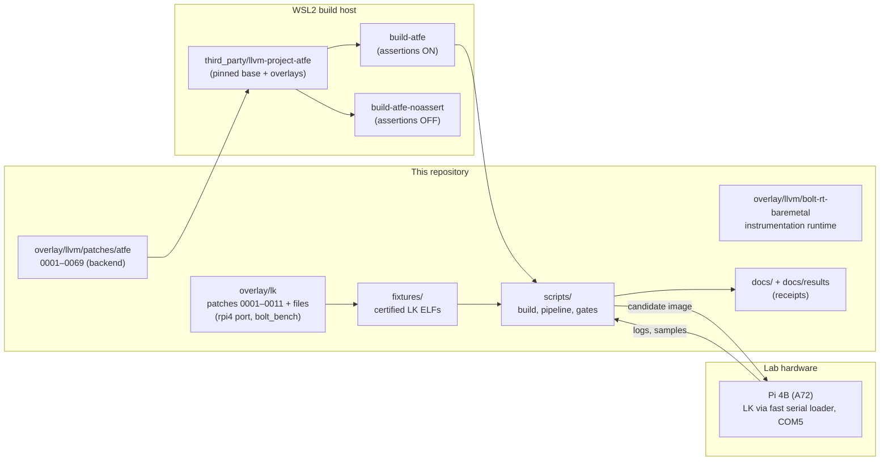
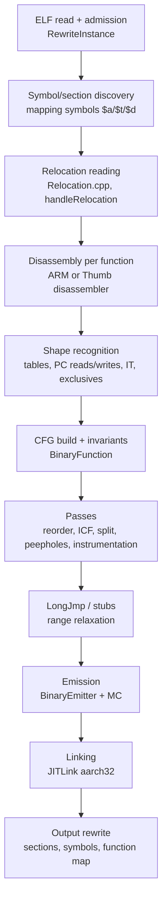
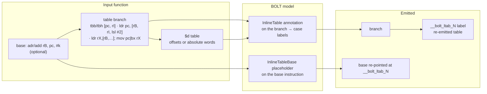
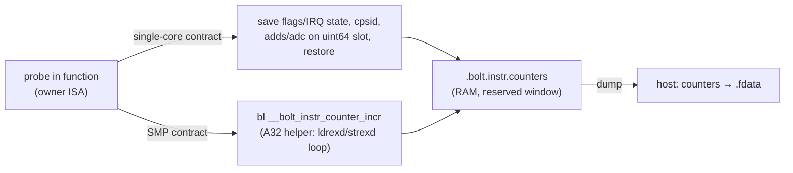
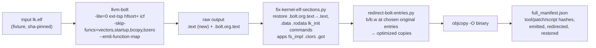

# BOLT AArch32 backend — architecture and design

Status of this document: current as of overlays **0001–0069** (2026-10-05).
It describes the backend as built and verified in this repository. Work order
and ownership are in [HANDOFF.md](HANDOFF.md). Limitations are in
[KNOWN_LIMITATIONS.md](KNOWN_LIMITATIONS.md#current-atfe-backend-limitations-re-baselined-2026-10-05).
The latest review is [CORRECTNESS_REVIEW_CLAUDE_0069.md](reviews/CORRECTNESS_REVIEW_CLAUDE_0069.md).
Older design notes ([architecture.md](history/architecture.md),
[BOLT_AARCH32_BACKEND.md](history/BOLT_AARCH32_BACKEND.md),
[aarch32-bolt.md](history/aarch32-bolt.md)) are history; where they disagree, this
document and HANDOFF win.

---

## 1. Purpose and scope

LLVM BOLT is a post-link optimizer. It disassembles a linked binary, rebuilds
control-flow graphs, applies profile-guided layout and other passes, and
writes a new binary. Upstream BOLT supports X86-64, AArch64 and RISC-V, but
has no 32-bit Arm target. This project adds that target, **AArch32 (A32 and
T32/Thumb-2)**, and makes it safe enough to rewrite a whole bare-metal LK
kernel image.

| | |
|---|---|
| Deliverable | An AArch32 BOLT backend, as an overlay series on the Arm Toolchain for Embedded (ATFE) LLVM fork |
| Real target | Cortex-A55, AArch32 state, SMP, always Non-secure SVC, no FPU/NEON, PMU sampling via IRQ, bare-metal LK, no SMC calls |
| Proof-of-concept target | Raspberry Pi 4B (Cortex-A72, AArch32, Non-secure SVC), matching the real target in security state, mode, SMP, no FPU/NEON and IRQ sampling |
| Diagnostic target | QEMU (`qemu-system-arm` with LK, `qemu-arm` user mode for the edge probe); debugging only, never certification |
| Input class | Static, fixed-load (`ET_EXEC`), LLD-linked with `--emit-relocs`, little-endian, ARMv7-A or ARMv8-A AArch32, `-mfpu=none`, `-fno-exceptions` |
| Optimizations used | Basic-block reordering (`ext-tsp`), function reordering (`hfsort+`/`cdsort`), ICF, function splitting, peepholes; instrumentation and sample-based profiles |

Design stance: **admit only what is modelled, and fail closed on everything
else.** Every unknown shape is a fatal admission error for that function.
The user then excludes it with `-skip-funcs` or it is reported by the
admission report. It is never transformed on a guess.

---

## 2. System context



Repository layout (backend-relevant parts):

| Path | Role |
|---|---|
| `overlay/llvm/patches/atfe/NNNN-*.patch` | The backend: plain unified diffs against the pinned ATFE base `bcc08884…`, one per logical change, each with its own lit/unit test |
| `overlay/llvm/bolt-rt-baremetal/` | Bare-metal instrumentation runtime (`libbolt_rt_baremetal.a`, built with `-mfpu=none`) |
| `overlay/lk/patches`, `overlay/lk/files` | LK changes: `--emit-relocs`, Pi 4 (bcm2711) port, BOLT window reservation, IRQ sample hook, no-FPU builds, Cortex-A55 build, `bolt_bench` workloads and sampler |
| `scripts/` | Build, overlay replay, coverage, full-image pipeline, Pi/QEMU gates, profile conversion |
| `scripts/review/edge_probe.py` | Differential edge-case probe (qemu-user, diagnostic) |
| `fixtures/` | Certified input images (full LK `424606a8`, A55 `47c73bc0`, SMP `e1139981`, `-marm` SMP `00d9c42d`, edge images `0895d7bc`/`439dfd7c`/`ce8dd005`) |
| `docs/results/` | Machine-readable receipts (coverage, certified gates, probe results) |

---

## 3. Source management

The backend lives as an **overlay series** over a pinned ATFE LLVM commit,
not as a fork with history.

- **One overlay per item.** Each defect or feature becomes the next
  `NNNN-*.patch` with its own test (lit `.test` + Python checker under
  `bolt/test/ARM/`, or a unit test under `bolt/unittests/Core/`).
- **Exact replay.** `scripts/verify-atfe-overlays.py` exports the base files
  the series touches, applies 0001–NNNN in a fresh Git tree and compares every
  result with the live tree. It reports mismatched or uncovered files and a
  source-identity hash. A series that does not replay exactly is not
  publishable. The live tree is never re-patched in place
  (`apply-overlays.sh` is not run on a dirty tree).
- **Both assertion modes.** Every overlay is tested on the assertions-ON
  build (`build-atfe`) and the assertions-OFF build
  (`build-atfe-noassert`). Some admission defects only show up when
  assertions are off.
- **Coordination.** Two agents (Claude and Codex) share the work through
  [HANDOFF.md](HANDOFF.md): a pushed live-tree lock, item claims, a separate
  Pi reservation, and a log entry on every stop.

---

## 4. Backend architecture inside BOLT

### 4.1 Where AArch32 hooks into BOLT



| BOLT stage | AArch32 additions | Main overlays |
|---|---|---|
| Target plumbing | `Triple::arm`, ELF32, `BinaryContext::isARM()`, `bolt/lib/Target/ARM/` (`ARMMCPlusBuilder`, `ARMMCSymbolizer`), factory dispatch | 0003, 0004, 0006 |
| Input admission | Fixed-load contract, ISA/ABI attribute contract, v8-A AArch32 features, unwind rejection | 0015, 0041, 0042, 0058 |
| ISA modelling | Per-function ISA, mapping symbols, dual builders, IT state isolation | 0003, 0021, 0063 |
| Relocations | ARM relocation classes and encoders, literal loads, data fixups, Thumb bit in data | 0005, 0014, 0016, 0022, 0068 |
| Disassembly/CFG | Terminators, PC-write/PC-read admission, fall-through, noreturn, predication, call idioms | 0018, 0027, 0029–0031, 0033, 0035, 0045, 0051–0053, 0055, 0064 |
| Inline tables | TBB/TBH, A32 `ldr pc`, Thumb `adr` base, `-O0` load-then-jump, base liveness | 0024, 0057, 0062, 0065–0067, 0069 |
| Passes | Generic passes enabled for ARM, inliner safety, ICF operand support, cbz reversal | 0011, 0023, 0032, 0034, 0056 |
| Range relaxation | LongJmp veneers, ISA-correct stubs, far tail calls, r12 liveness, cbz/Jump19 | 0009, 0020, 0022, 0044, 0049, 0061 |
| Emission/linking | JITLink aarch32 kinds, stub alignment, BLX stubs, deterministic stubs, ISA traps/nops | 0008, 0012, 0014, 0017, 0019, 0050 |
| Kept code | Re-patching branches in code BOLT does not emit, entry patching in the right ISA | 0025, 0046, 0048 |
| Instrumentation | Counter probes, runtime contracts, SMP counters, exclusives, startup, profile identity | 0001, 0010, 0026, 0028, 0036–0040, 0043, 0059, 0060 |
| Reporting | Function map, admission report | 0013, 0054 |

### 4.2 Input admission (contracts)

Admission runs before any transformation and is fatal on failure:

- **Fixed-load contract (0042).** BOLT generates absolute addresses
  (`movw/movt` stubs, absolute table words), so the input must be `ET_EXEC`
  with real `PT_LOAD` segments and no `PT_INTERP`/`PT_DYNAMIC`/`PT_TLS`.
  Static PIE is rejected even though it looks static.
- **ISA/ABI contract (0041, 0058).** The `.ARM.attributes` (AEABI file
  scope) must be well formed and within the supported set: ARMv7-A, or
  ARMv8-A in AArch32 state (Cortex-A55). ARMv9 and other profiles are
  rejected. The disassembler gets `v7`, `aclass` and `thumb2`, plus `v8.2a`,
  `trustzone`, `virtualization` and `mp` when the attributes allow them. FP
  and NEON come only from FP/SIMD attributes, which project inputs never
  carry. The instrumentation runtime must satisfy the same contract.
- **Unwind tables (0015).** `.ARM.exidx` holding only `EXIDX_CANTUNWIND` is
  accepted. Compact descriptors and `.ARM.extab` references are rejected.
  Unwinding through rewritten code is out of scope.
- **No FPU/NEON** is a project rule enforced outside BOLT
  (`scripts/check-no-fpu.sh` on inputs, the runtime and LK builds).

### 4.3 ISA modelling

**ISA is a function property.** A32 and T32 are different encodings; the
CPU switches between them only on interworking branches (`bx`, `blx`, loads
to PC, exception returns). The backend gives each `BinaryFunction` one ISA
(`isARMThumb()`), decided at discovery from the symbol's bit 0 and the
`$a`/`$t` mapping symbols. `$d` marks data in code (literal pools, inline
tables), which becomes a constant island and is never decoded.

**Two MCPlusBuilders, never mutated.** `BinaryContext::getMIBFor(bool
IsThumb)` returns either the primary (A32) builder or a separate `ThumbMIB`.
Every ISA-sensitive call site selects one explicitly:

```cpp
MCPlusBuilder *MIB = BC.getMIBFor(BC.isARM() && BF.isARMThumb());
```

An earlier design switched one builder's subtarget in place, which was a data
race under BOLT's parallel passes. The primary builder still owns generic
annotation indices and allocators (0031); the mode builder supplies
instruction semantics.

**Thumb bit discipline.** Bit 0 of an ARM code address is ISA state, not
address:

- Function symbols and `e_entry` keep their Thumb bit (0021).
- Code addresses inside BOLT are always even.
- The bit is added back when an address is written out:
  - relocation flush: `ABS32`/`TARGET1`/`MOVW`/`MOVT` against a Thumb function get bit 0;
  - data words: carried as addend 1 (0068), so `emitAsData` keeps it too;
  - interworking calls: `BL`↔`BLX` chosen from the target ISA (`adjustCallForTargetMode`);
  - stubs: always in their owner's ISA (0044).

**IT blocks.** T32 IT blocks predicate up to four following instructions. The
disassembler's IT state must not leak between functions, data or re-decodes.
`MCDisassembler::resetState()` (0063) is called at every function and
re-decode start. Predicated returns and calls at the end of an IT group stay
inside their block with a fall-through (0053). A terminal direct branch is
moved out of its IT group (0027).

### 4.4 Disassembly, CFG and admission of control flow

The ARM builder classifies every instruction for BOLT's CFG builder. The
guiding rule is that **a PC write or PC read the backend cannot relocate is a
rejection, not a guess.**

| Shape | Handling | Overlay |
|---|---|---|
| `pop {…, pc}`, `ldm sp!, {…, pc}` | Return/terminator; only the canonical stack pop counts as a return | 0018, 0033 |
| Other PC writes: computed `mov pc`, `add pc`, `ldr pc` (outside modelled tables), arbitrary `ldm` with PC | Rejected (`unsupported AArch32 PC-writing control transfer`) | 0033 |
| Exception returns (`movs pc, lr`, `subs pc, lr`, `ldm …^` with PC, `rfe`, `eret`) | Rejected; vectors and early startup stay in place permanently | 0035 |
| PC as data (`adr`, `add rX, pc`, `ldr` literal of other widths) | Only modelled word literal loads and recognized table bases; everything else rejected | 0014, 0045 |
| Function fall-through into the next symbol | Rejected unless the last call is proven noreturn | 0030, 0052 |
| Noreturn callees | Proven from the input bytes (self-loops, chains of noreturn calls, absolute thunks) with a cycle guard; unproven is not noreturn | 0052, 0064 |
| Conditional tail calls (`b<c> other_fn`) | Modelled; retargeted to a local tail-call block | 0051 |
| `mov lr, pc; b f` (A32 call idiom) | Converted to a real call to the same target | 0055 |
| `mov rX, rX` with flags or PC | Never removed as a no-op | 0031 |
| Pseudo-instruction count invariants | Enforced, so ARM no longer swallows core invariant violations | 0029 |
| `cbz`/`cbnz` | Reversible by opcode swap; out of range becomes `cbnz skip; b.w target` (flags preserved) | 0011, 0020 |

### 4.5 Inline jump tables

Compilers emit switch tables as data inside the function, addressed
relative to the PC. BOLT moves code, so the table must be decoded,
re-emitted next to its branch, and every base pointing at it re-pointed.



| Form | Recognition | Admission conditions | Overlay |
|---|---|---|---|
| T32 `tbb`/`tbh [pc, rI]` | Branch followed by a `$d` island; entries are halfword offsets from the table | Targets inside the function, past the table, even; padding entries dropped | 0024 |
| A32 `ldr pc, [rB, rI, lsl #2]` + absolute words | `add/sub/adr rB, pc, #imm` whose target is the table right after the branch; rotated immediates decoded | Base reaches the branch unchanged in one block (no label, branch, call or redefinition, including register-list loads) | 0057, 0062, 0065 |
| T32 `adr.w rB, table` + `tbb/tbh` | `adr` directly before the branch | Nothing branches to the table branch | 0066 |
| A32 `-O0` `ldr rX, [rB, rI, lsl #2]; mov pc, rX` / `bx rX` | Load adjacent to the jump; table right after it | Every case redefines rX before reading it | 0067 |
| All re-pointed bases | — | **rB is dead at every case target**: on every path it is redefined unconditionally before any read. Calls and returns end a call-clobbered rB (AAPCS); a callee-saved rB must be restored | 0069 |

The emitter writes each table right after its branch, under a fresh label,
and substitutes that label into the base instruction's placeholder operand.
Tables survive block reordering, ICF and splitting. Splitting can put cases
in a cold fragment, which is legal for absolute and halfword tables within
range.

### 4.6 Relocations and references

`Relocation.cpp` gains ARM classification and encoding (`isSupportedARM`,
`isPCRelativeARM`, `encodeValueARM`, `extractValueARM`, sizes, skips):
`CALL`, `JUMP24`, `PC24`, `PLT32`, `THM_CALL`, `THM_JUMP24`, `THM_JUMP19`,
`ABS32`, `REL32`, `PREL31`, `TARGET1`, `TARGET2`, `MOVW_ABS_NC`/`MOVT_ABS`
(A32 and T32), `ALU_PC_G0`, `V4BX` and `NONE`. Thumb literal loads use the
JITLink `Thumb_LdrPcRel` kind.

| Concern | Design |
|---|---|
| Literal pool loads (`ldr rX, [pc, #k]`) | Symbolized as label-relative loads, so moved code still reaches its pool; T32 needs the JITLink `Thumb_LdrPcRel` kind (0008, 0014) |
| `B<c>.W` (`THM_JUMP19`) | Emitted by MC and applied by JITLink, never re-encoded through pending relocations (the condition lives in the instruction) (0022) |
| Data fixup width | Function-map/address-map fields written at ELF32 width and zero-extended (0016) |
| Branches in code BOLT does not emit | Re-encoded in place to the moved targets, keeping condition, BL/BLX form and ISA (0025, 0046); `check_raw_original_text.py` audits this |
| Entry patching | `PatchEntries` writes the redirect in the ISA of the overwritten function (0048) |
| Data pointers to Thumb code | Odd data words into a Thumb function resolve the even code address with addend 1 (function starts and interior entries) (0068) |

### 4.7 Emission and linking

BOLT emits through MC and links new code with JITLink's `aarch32` backend.
The overlays extend JITLink to cover:

- the generic `arm`/`thumb` triple (no explicit arch version) (0008);
- Thumb literal loads (0008, 0014);
- halfword-aligned Thumb stubs, so BOLT and JITLink agree on padding (0012);
- BLX→BL stub links that keep the link bit (0017);
- deterministic stub placement and alignment, so outputs are byte-reproducible (0019);
- `THM_JUMP19` for split functions (0022).

Traps and nops are emitted in the ISA of the code they replace: `udf` is
A32 `0xe7ffdefe`, T32 `0xdefe` (0050). `--emit-function-map` (0013) writes
`<name> <input addr> <output addr> <size>` for every emitted function; the
full-image pipeline uses it to redirect original entries.

### 4.8 Range relaxation (LongJmp)

Branch reach is limited:

| Branch | Reach |
|---|---|
| A32 `b`/`bl` | ±32 MB |
| T32 `b.w`/`bl` | ±16 MB |
| T32 `b<c>.w` | ±1 MB |
| `cbz` | 0–126 bytes forward |

LongJmp (0009) inserts stubs when the tentative layout puts a target out of
reach:

- Stubs are `movw/movt r12; bx r12` in the **owner's ISA** and are never
  shared across ISAs (0044).
- Tail calls go through a same-ISA stub as a branch, never as `bl`/`blx`,
  which would clobber LR (0049).
- Calls and tail calls may clobber r12 under AAPCS. A **local** branch stub
  (hot to cold fragment) may not: it is rejected when r12 is live at the
  target (0061).
- PIC inputs cannot be relaxed; they are already excluded by the fixed-load
  contract.

### 4.9 Optimization passes

Generic passes run on ARM where the backend provides their primitives (0023):

- block reordering;
- function reordering;
- ICF, including `:lower16:`/`:upper16:` operands (0056);
- hot/cold splitting;
- peepholes.

The inliner (0032, 0034) treats `--force-inline` as a profitability override
only. Architectural safety (IT state, PC-relative metadata, CFI) can never
be bypassed. Some passes were confirmed X86-only and stay off: indirect-call
promotion, register reassignment and frame optimization.

### 4.10 Instrumentation

Instrumentation places counters on spanning-tree edges and is the
profile-collection path for images that cannot be sampled.



- **Contract required (0028, 0060).** ELF metadata cannot prove privilege or
  concurrency, so the caller declares one:
  - `privileged-single-core-no-fiq`: a non-atomic 64-bit update with IRQs
    masked around it (0026);
  - `privileged-smp-no-fiq`: an injected A32 helper updates counters with
    `ldrexd/strexd`, so any number of cores may run instrumented code.

  In both cases, reset and snapshot must be quiescent. FIQ code must not be
  instrumented.
- **Shapes refused by instrumentation:**
  - conditional returns, which have no CFG edge to count (0036);
  - probes inside exclusive reservation windows, including windows that
    cross functions or start at interior entries. An abandoned reservation
    returned from a try-lock path is admitted only when a raw scan finds no
    outside store (0037–0039, 0059).
- **Startup (0040).** Entry and fini pointers keep their ISA bit, and
  trampolines are validated before creation. The bare-metal runtime ignores
  dynamic finalization.
- **Profile identity (0043).** The instrumented output binds profile metadata
  to a hash of the exact input buffer, so stale or mixed profiles are
  detected.
- **Runtime.** `libbolt_rt_baremetal.a` keeps counters in RAM, makes no
  syscalls and is built without FPU. Tables travel in the `.bolt.instr.tables`
  note (0001), and a host script turns counter dumps into `.fdata`.

### 4.11 Admission report

`--arm-admission-report=<json>` with `-o /dev/null` (0054) collects every
local admission rejection in one report-only scan instead of failing on the
first. It emits no binary and is not a certificate. `scripts/lk_coverage_report.py`
uses it to build the skip list, then runs normal fatal admission with those
skips to measure what is actually emitted.

---

## 5. Bare-metal integration (LK)

| LK overlay | Purpose |
|---|---|
| 0001 `emit-relocs-for-bolt` | Link with `--emit-relocs` (BOLT relocation mode) |
| 0002–0004 | Raspberry Pi 4 (bcm2711) platform, UART baud, watchdog reboot |
| 0005 | Module-level LTO opt-in |
| 0006 `reserve-bolt-window` | Reserve 1 MB after the image (`boot_alloc_mem`) so LK's page array does not overwrite BOLT's new segments |
| 0007, 0008 | No FPU/NEON anywhere on rpi4 |
| 0009 `irq-sample-hook` | Weak `bolt_sample_on_irq(frame, vector)` in the GIC IRQ path, so the sampler sees the interrupted PC/CPSR |
| 0010 | Optional GPU for the QEMU virt twin |
| 0011 | Cortex-A55 AArch32 build (`RPI4_ARM_CPU=cortex-a55`) |

`overlay/lk/files/app/bolt_bench` provides:
- deterministic workloads with independent oracles (`scripts/qemu_bench_oracle.py`);
- the PMU-IRQ PC sampler (`bolt_sample`) with checksum-verified dumps (`bolt_dump`);
- per-core SMP workloads (`bolt_bench smp`);
- the generated edge-case image (`scripts/bolt_edge/`).

Loading uses a hot-loaded fast serial loader (`tools/pi4-serialboot-fast/`);
sample dumps are read back chunk by chunk with checksum verification.

---

## 6. Host pipelines

### 6.1 Full-image rewrite

LK boots with the MMU off from its original addresses, and many tables
(`lk_init`, `commands`, `.data`, `.rodata`) hold function pointers. The
pipeline therefore **keeps the original image intact and adds the optimized
code beside it**, then redirects chosen entry points. Restored from the input:
`.bolt.org.text` (back to `.text`), `.data`, `.rodata`, `lk_init`, `commands`,
`apps`, `fs_impl`, `.ctors` and `.got`.



Consequences of this design:

- **Emission is not execution.** A rewritten copy runs only when its
  original entry is redirected, or when another running rewritten copy calls
  it directly.
- Data pointers keep targeting original entries, so address-taken functions
  work, at the cost of one extra branch through a redirect stub.
- Startup, vectors and real fall-through code (`bcopy`→`memset`) stay
  original permanently.
- The manifest binds the result to exact tool, overlay and script hashes, and
  `full_image_verify.py` refuses mismatches.

### 6.2 Profile collection

Two routes produce `.fdata`:

| Route | Flow | Notes |
|---|---|---|
| Sampling (preferred on the Pi) | Sealed image → `pi4_sample_profile.py` (PMU overflow IRQ, per-core watch ranges) → raw PCs (bit 0 = Thumb) → `samples_to_fdata.py` (`perf2bolt -nl -pa`) → `full_image_build.py --profile` | No instrumented image; IRQ-masked code is invisible; `profile_identity.py` seals images and captures |
| Instrumentation | `llvm-bolt -instrument --arm-instrumentation-contract=…` → counters in RAM → dump → `ram-dump-to-fdata.py` | Exact edge counts; refuses shapes listed in §4.10 |

### 6.3 Verification gates

| Gate | What it proves | Tool |
|---|---|---|
| Lit + unit tests | Each overlay's shape, both assertion modes | `bolt/test/ARM/*.test`, `bolt/unittests/Core/ARM*.cpp` |
| Overlay replay | Source identity of 0001–NNNN | `verify-atfe-overlays.py` |
| Coverage | Per-function status and per-byte attribution of every executable section | `lk_coverage_report.py` → `docs/LK_COVERAGE.md` |
| Kept-code audit | Re-patched branches in non-emitted code keep ISA/condition/form | `check_raw_original_text.py` |
| Certified full-image gate (Pi) | Exact artifacts; 18 workload results equal the **user-approved** oracle over 10 repetitions; sampled PCs inside every required rewritten function in the right ISA | `full_image_verify.py` |
| SMP gate (Pi) | Rewritten code ran on every core concurrently with correct per-core sinks | `smp_verify.py`, `smp_counter_check.py` |
| Edge image (Pi) | 146 generated edge cases × 2 rewritten, 0 mismatches | `scripts/bolt_edge/` |
| Differential probe (qemu-user, diagnostic) | 26 edge programs × 7 option sets match the original | `scripts/review/edge_probe.py` |

Evidence rules:
- hardware claims come only from the Pi, with the watchdog armed;
- oracle contracts for new images need the user's review;
- QEMU routes are labelled diagnostic;
- every certified run writes a hashed receipt to `docs/results/`.

---

## 7. Current status (2026-10-05)

| Measure | Value |
|---|---|
| Overlays | 0001–0069, replay exact |
| Lit | ARM 58/58 in both assertion modes; BOLT suite: known AArch64 `constant_island_pie_update.s` failure only |
| Full LK `424606a8` (ARMv7) | 401/417 functions rewritten; 126164 of 126834 code bytes (99.5%) |
| Remaining rejections | 7 exception/startup PC writers (vectors, `arm_secondary_setup`), 2 real fall-throughs (`bcopy`, `bzero`) |
| A55 `47c73bc0` | 400 rewritten; certified on the Pi |
| Edge image `ce8dd005` | 561 rewritten; 146 × 2 cases on the Pi, 0 mismatches |
| SMP | Rewritten code on all cores; SMP counters verified |
| Edge probe | 158 OK, 24 known safe rejections, 0 wrong |
| Not yet run | Real Cortex-A55 hardware (T4, the user) |

---

## 8. Key design decisions

| Decision | Alternative rejected | Reason |
|---|---|---|
| Overlay series on a pinned base | Long-lived fork branch | Exact, reviewable, replayable deltas; one test per change |
| Two MCPlusBuilders selected per function | Switching one builder's subtarget | The shared mutable state raced under parallel passes |
| ISA per function | ISA per instruction | Matches how compilers and linkers emit AArch32; mapping symbols give it directly |
| Fail closed on every unmodelled shape | Best-effort rewriting | A wrong kernel is worse than an unoptimized function; coverage grows by modelling shapes one at a time |
| Re-emit inline tables, re-point bases | Treat table functions as non-simple | Switch-heavy code is common in firmware; leaving it unoptimized would exclude much of the image |
| Base liveness proof for re-pointed tables | Trust that bases are dead | Layout-dependent wrong results were found (R26) |
| Keep original image, add code, redirect entries | Replace `.text` in place | LK boots MMU-off from fixed addresses with pointer tables everywhere; this keeps all data valid |
| Explicit instrumentation contracts | Infer privilege/concurrency | ELF metadata cannot prove either; wrong guesses corrupt counters |
| Pi as the only certifying target | QEMU certification | Emulation hides timing, memory-ordering and device behaviour; QEMU twin images also lack a protected BOLT window |
| Independent, user-approved oracles | Learning expected values from a baseline run | A baseline can be wrong; the oracle must not come from the system under test |

---

## 9. Extending the backend

To support a new instruction shape safely:

1. **Reproduce** it with a minimal assembly case (lit checker or
   `edge_probe.py` case) and confirm the current behaviour (rejection or
   wrong result).
2. **Claim** the item and the live-tree lock in HANDOFF (pushed).
3. **Model it narrowly**:
   - add the recognition to `ARMMCPlusBuilder` (ISA-specific predicates)
     and the bookkeeping to `BinaryFunction`/`BinaryEmitter`;
   - keep every nearby variant rejected;
   - prove any state you rely on (register liveness, block-local
     survival, ISA bits) instead of assuming it.
4. **Test** both admitted and must-reject variants, in default and reversed
   layouts, on both assertion builds. Show that the unfixed build fails the
   new test.
5. **Export** the next overlay, run `verify-atfe-overlays.py`, regenerate
   coverage, and run the certified Pi gate when admitted code changes.
6. **Record** it: a HANDOFF Done row and log entry, and a KNOWN_LIMITATIONS
   update if scope changed.

---

## Appendix A. Overlay index

| # | Overlay | Purpose |
|---|---|---|
| 0001 | emit-bolt-instr-tables-on-elf | Emit `.bolt.instr.tables` for a custom (bare-metal) runtime |
| 0002 | tolerate-secondary-entrypoint-outside-code-section | Bare-metal ELFs may have entries outside `.text` |
| 0003 | bolt-arm-elf32-and-target | ELF32, `Triple::arm`, `isARM`, per-function ISA, `getMIBFor`/`ThumbMIB`, mapping symbols |
| 0004 | bolt-arm-mcplusbuilder | `bolt/lib/Target/ARM`: `ARMMCPlusBuilder`, `ARMMCSymbolizer` |
| 0005 | bolt-arm-relocations | ARM relocation classification, encoding and extraction |
| 0006 | bolt-arm-rewrite-dispatch | Rewrite pipeline and JITLink dispatch for ARM |
| 0007 | bolt-arm-lit-tests | Initial ARM lit suite |
| 0008 | jitlink-arm-generic-archkind | Generic `arm` triple → ARMv7-A; `Thumb_LdrPcRel` |
| 0009 | bolt-arm-longjmp-veneers | LongJmp stubs and veneer elimination for ARM |
| 0010 | bolt-arm-instrumentation | Instrumentation snippets built with the caller's ISA builder |
| 0011 | bolt-arm-reverse-cbz | `cbz`/`cbnz` reversal by opcode swap |
| 0012 | jitlink-arm-thumb-stub-alignment | Halfword-aligned Thumb stubs |
| 0013 | bolt-emit-function-map | `--emit-function-map` for entry redirection |
| 0014 | bolt-arm-literal-loads | PC-relative literal loads relocated with moved code |
| 0015 | bolt-arm-unwind-rejection | Accept CANTUNWIND-only exidx; reject real unwind data |
| 0016 | bolt-arm-data-fixup-width | ELF32-width address-map/data fixups |
| 0017 | jitlink-arm-blx-stub-link | BLX→BL stub conversion keeps the link bit |
| 0018 | bolt-arm-pop-terminators | PC-restoring loads terminate blocks; predicated ones stay in-block |
| 0019 | deterministic-arm-stubs-and-alignment | Byte-reproducible stub placement |
| 0020 | preserve-flags-in-cbz-long-branches | Out-of-range `cbz` → `cbnz skip; b.w` without touching flags |
| 0021 | preserve-thumb-entry-and-symbol-state | Thumb bit kept on `e_entry` and STT_FUNC values |
| 0022 | bolt-arm-thumb-jump19-split-functions | `B<c>.W` (`THM_JUMP19`) across split fragments |
| 0023 | bolt-arm-generic-passes | Generic passes enabled for ARM; branches built in the function's ISA |
| 0024 | bolt-arm-inline-switch-tables | TBB/TBH tables decoded and re-emitted |
| 0025 | bolt-arm-attributes-kept-code | Re-encode branches in kept (non-emitted) old code |
| 0026 | bolt-arm-full-width-counters | 64-bit counters with saved flags and IRQ state |
| 0027 | bolt-arm-terminal-it-branches | Terminal direct branch moved out of its IT group |
| 0028 | bolt-arm-instrumentation-contract | Mandatory `--arm-instrumentation-contract` |
| 0029 | bolt-arm-pseudo-count-invariants | Core pseudo-instruction invariants enforced on ARM |
| 0030 | bolt-arm-function-fallthrough | Inter-function fall-through rejected |
| 0031 | bolt-arm-self-move-flags | Self-moves that write CPSR/PC are kept |
| 0032 | bolt-arm-inline-safety | Inliner safety cannot be forced |
| 0033 | bolt-arm-pc-write-admission | Unmodelled PC writes rejected |
| 0034 | bolt-arm-inline-pass-tests | Inliner option matrix tests |
| 0035 | bolt-arm-exception-return-admission | Exception returns rejected |
| 0036 | bolt-arm-conditional-return-instrumentation | Instrumentation refuses conditional returns |
| 0037 | bolt-arm-exclusive-instrumentation | No probes inside exclusive reservation windows |
| 0038 | bolt-arm-cross-function-exclusive-reservations | Reservations spanning functions |
| 0039 | bolt-arm-interior-exclusive-reservations | Reservations entered at interior addresses |
| 0040 | bolt-arm-instrumentation-startup | ISA-correct instrumentation entry/fini |
| 0041 | bolt-arm-isa-abi-contract | `.ARM.attributes` admission for input and runtime |
| 0042 | bolt-arm-fixed-load-contract | `ET_EXEC` fixed-load inputs only |
| 0043 | bolt-arm-profile-source-identity | Profile bound to the input's hash |
| 0044 | bolt-arm-thumb-far-stub-isa | Stubs in their owner's ISA, never shared across ISAs |
| 0045 | bolt-arm-pc-read-admission | Unmodelled PC reads rejected |
| 0046 | bolt-arm-external-branch-repatch | In-place re-encoding of branches from non-emitted code |
| 0047 | bolt-riscv64-relocation-dispatch | Shared `Relocation.cpp` dispatch cleanup for the riscv64 cases (no ARM behaviour change) |
| 0048 | bolt-arm-patch-entries-isa | Entry patches in the overwritten function's ISA |
| 0049 | bolt-arm-far-tail-call-stub | Far tail calls branch to a same-ISA stub |
| 0050 | bolt-arm-isa-traps-and-nops | `udf`/nop in the right ISA |
| 0051 | bolt-arm-conditional-tail-calls | Conditional tail calls modelled |
| 0052 | bolt-arm-noreturn-calls | Noreturn proofs from input bytes |
| 0053 | bolt-arm-predicated-returns-calls | IT-final predicated returns/calls |
| 0054 | bolt-arm-admission-report | Report-only admission scan |
| 0055 | bolt-arm-mov-lr-pc-call | `mov lr, pc; b f` call idiom |
| 0056 | bolt-arm-icf-specifier-exprs | ICF on `:lower16:`/`:upper16:` operands |
| 0057 | bolt-arm-ldr-pc-inline-tables | A32 `ldr pc` absolute tables |
| 0058 | bolt-arm-v8a-aarch32 | ARMv8-A AArch32 (Cortex-A55) admission and decode |
| 0059 | bolt-arm-abandoned-reservation | Try-lock paths that abandon a reservation |
| 0060 | bolt-arm-smp-counters | `privileged-smp-no-fiq` LDREXD/STREXD counter helper |
| 0061 | bolt-arm-r12-local-stub | Local stubs rejected when r12 is live |
| 0062 | bolt-arm-table-base-ldm-list | Register-list loads clobbering a table base |
| 0063 | arm-disassembler-it-state-isolation | `MCDisassembler::resetState()` for IT state |
| 0064 | bolt-arm-thunk-cycle-guard | Noreturn thunk traversal cycle guard |
| 0065 | bolt-arm-table-base-mod-imm | Rotated immediates in table bases |
| 0066 | bolt-arm-thumb-table-adr-base | Thumb `adr` base re-pointed at the emitted table |
| 0067 | bolt-arm-load-jump-table | A32 `-O0` load-then-jump tables |
| 0068 | bolt-arm-thumb-data-pointer | Thumb bit kept on data pointers to Thumb code |
| 0069 | bolt-arm-table-base-liveness | Re-pointed table bases must be dead at all cases |

## Appendix B. Glossary

| Term | Meaning |
|---|---|
| A32 / T32 | ARM (fixed 32-bit) and Thumb-2 (16/32-bit) instruction sets of AArch32 |
| Interworking | Switching ISA on a branch (`bx`, `blx`, PC loads) using bit 0 of the target |
| Mapping symbols | `$a`, `$t`, `$d`: start of A32 code, T32 code, and data in code |
| IT block | Thumb `IT` instruction predicating up to four following instructions |
| Admission | BOLT's decision to rewrite a function; failure is fatal unless skipped |
| Emission vs execution | A function emitted by BOLT runs only if something enters the new copy |
| Redirect | A branch written at an original entry to its optimized copy |
| Oracle contract | User-approved independent expected results for one input image |
| Receipt | Hashed JSON evidence of a run in `docs/results/` |
