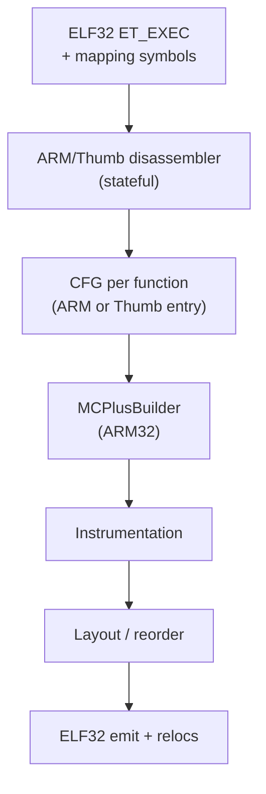

# AArch32 BOLT — design and upstream path

**Goal:** implement ARM/Thumb BOLT in LLVM and merge to upstream. LK on QEMU ARM32 is the bare-metal test harness; RAM profiling from Phase 2 carries over unchanged.

**Fact:** `bolt/lib/Target/` contains only `AArch64`, `RISCV`, and `X86` — there is **no ARM32/Thumb backend**. Building with `LLVM_TARGETS_TO_BUILD=…;ARM` gives clang and lld an AArch32 target but does nothing for BOLT.

**Base branch:** Phases 1–2 build `release/23.x`. Phase 3 rebases onto `main`, because that is what LLVM reviews patches against.

---

## Architecture (new backend)

New code lives primarily in `bolt/` (upstream). This repo holds **incremental patches** in `overlay/llvm/patches/` until each slice is ready for a Phabricator/GitHub PR.

---

## AArch32 constraints and edge cases

### Binary format

| Topic | Implication for BOLT |
|-------|----------------------|
| ELF32 | 32-bit addresses, `Rel` (addend in-place) common on bare-metal |
| `Rel` vs `Rela` | Must handle both; addend may live in patched insn |
| Mapping symbols `$a`, `$t`, `$d` | Required to separate code vs inline data in `.text` |
| `.ARM.attributes` | CPU arch, Thumb ISA, ABI — drives ISA rules |
| `.ARM.exidx` / `.ARM.extab` | Exception tables; blocks must not split unwind entries |
| Build attrs | ARMv4T–ARMv8 AArch32; pick **ARMv7-A + Thumb-2** first |

### ISA state

| Topic | Implication |
|-------|-------------|
| Thumb bit (LSB=1) | Symbol + address state; wrong state = garbage disasm |
| ARM vs Thumb entry | Function entry state from symbol type (`STT_FUNC`, LSB) |
| Interworking branches | `BL`/`BLX`, `BX`, `LDR pc`, `POP {pc}` — edges cross state |
| `.glue_7` / `.glue_7t` | Linker veneers; treat as synthetic blocks or follow into target |
| ARM `BL` range | ±32 MB — may need linker veneers before BOLT rewrite |
| Thumb `BL`/`BLX` range | ±16 MB / ±4 MB (encoding dependent) — stub insertion |
| IT blocks | **Atomic unit** — cannot instrument inside `IT`; whole block or skip |
| 16/32-bit Thumb mix | Variable insn size — BB boundaries from disassembler only |
| Literal pools | `LDR rN, [pc, #off]` — data islands; not code; respect `$d` |
| `ADR` / `ADRP` (Thumb) | PC-relative; becomes PC-rel fixup after move |
| CBZ/CBNZ, TBB/TBH | PC-relative branches; update offsets on layout change |
| Inline data in code | Jump tables, constants — use mapping symbols + disasm skip |
| PIC / relocatable | Bare-metal LK often static; PIC later via `R_ARM_RELATIVE` |

### Relocations to handle (minimum set)

| Reloc | Use |
|-------|-----|
| `R_ARM_CALL`, `R_ARM_JUMP24` | ARM interworking calls |
| `R_ARM_THM_CALL`, `R_ARM_THM_JUMP24` | Thumb calls |
| `R_ARM_THM_JUMP11`, `R_ARM_THM_JUMP19` | Short Thumb branches |
| `R_ARM_ABS32`, `R_ARM_REL32` | Data fixups after move |
| `R_ARM_TARGET1/2` | GNU ifunc / special — defer |

### BOLT-specific risks

| Risk | Mitigation |
|------|------------|
| Split IT block | Detect `IT` header; keep block intact or exclude function |
| Move literal pool | Co-move pool with referencing insns or leave pool fixed initially |
| Split function across ARM+Thumb | Rare in one symbol; split by mapping symbols if needed |
| Instrumentation size | Thumb hooks may need veneer if hook stub out of range |
| Profile counters | Reuse the Phase 2 RAM scheme; 32-bit atomics via `ldrex`/`strex`, or mask IRQs |
| Runtime library | Cross-build ours for `arm-none-eabi`; upstream still cannot build bolt-rt per-triple ([#187308](https://github.com/llvm/llvm-project/pull/187308)) |
| `--emit-relocs` | Same requirement as AArch64 |

### Out of scope (initial upstream PRs)

- M-profile (Cortex-M) — different branch model, no classic interworking
- ThumbEE, Jazelle
- ARMv8 AArch32 BTI/PAC (add later if needed)
- Shared libraries / PLT-heavy glibc binaries

---

## Implementation order (overlay → upstream PRs)

Each row = one or more patches in `overlay/llvm/patches/`, then upstream PR.

| # | Deliverable | Tests | Upstream PR theme |
|---|-------------|-------|-------------------|
| 1 | ELF32 reader in BOLT (`BinaryContext`) | Unit: parse LK ARM32 ELF | "BOLT: ELF32 groundwork" |
| 2 | Stateful disasm: ARM-mode functions only | FileCheck on `.s` snippets | "BOLT: AArch32 disassembly" |
| 3 | CFG + basic blocks (ARM, no Thumb yet) | CFG dump lit tests | "BOLT: AArch32 CFG ARM mode" |
| 4 | `MCPlusBuilder` ARM32 (relocs, branches) | Rewrite single BB | "BOLT: AArch32 MCPlusBuilder" |
| 5 | Branch veneers / range extension | Out-of-range call test | "BOLT: AArch32 branch relaxation" |
| 6 | Thumb-2 functions (no IT) | Thumb hot loop binary | "BOLT: AArch32 Thumb-2" |
| 7 | IT block detection + atomic units | IT-heavy asm tests | "BOLT: AArch32 IT blocks" |
| 8 | Interworking edges | ARM↔Thumb call tests | "BOLT: AArch32 interworking" |
| 9 | Instrumentation + bolt-rt (RAM path) | LK `bolt_bench` ARM32 | "BOLT: AArch32 instrumentation" |
| 10 | Layout optimization passes | Before/after timing on LK | "BOLT: AArch32 optimization" |
| 11 | Documentation `docs/BOLT AArch32.rst` | — | "Docs: BOLT ARM32" |

Validate on **LK `qemu-virt-arm32-test`** + synthetic lit binaries before claiming completeness.

---

## Upstream merge strategy

1. **Track LLVM `main`** — the overlay rebases on tip; release branches do not accept features.
2. **Small PRs** — each passes CI; no monolithic dump.
3. **Tests first** — every PR adds `llvm/test/tools/llvm-bolt/...` lit tests.
4. **No LK in LLVM** — tests use checked-in tiny ELFs built from `.s` in test tree.
5. **Copyright** — LLVM license; use `[bolt]` prefix in commit messages per LLVM convention.
6. **Community** — post RFC on [LLVM Discourse](https://discourse.llvm.org) (BOLT category) before large API changes.
7. **Phased merge** — disasm/CFG can merge before instrumentation; feature-gate with `-march=arm` or triple `arm-*`.

### What stays in this overlay repo

| Stays here | Goes upstream |
|------------|---------------|
| LK patches, linker scripts, `bolt_bench` | `bolt/lib/Target/AArch32/` (new) |
| `ram-dump-to-fdata.sh`, RunPod scripts | ELF32 reader, MCPlusBuilder, tests |
| QEMU run recipes | bolt-rt bare-metal hooks (optional) |
| Design docs (this file) | User-facing docs in llvm-project |

When a patch merges upstream, **delete** the corresponding file from `overlay/llvm/patches/`.

---

## Phase 3 checklist (high level)

| Step | Task |
|------|------|
| 3.1 | Rebase overlay on LLVM with Phase 2 learnings |
| 3.2 | ELF32 `BinaryContext` + triple `arm-none-eabi` |
| 3.3 | ARM-mode CFG (steps 1–5 above) |
| 3.4 | Thumb-2 + IT + interworking (steps 6–8) |
| 3.5 | Instrumentation + RAM profile on LK ARM32 |
| 3.6 | First upstream PR (disasm/CFG); iterate |
| 3.7 | Full optimization validated; docs in LLVM tree |

---

## Success criteria (project complete)

- [ ] `llvm-bolt` instruments and optimizes ARM32 LK ELF on bare-metal profile
- [ ] Lit test coverage for ARM, Thumb-2, IT, interworking, veneers
- [ ] At least core backend merged to **llvm-project** `main`
- [ ] Overlay repo contains only unmerged deltas + LK harness
