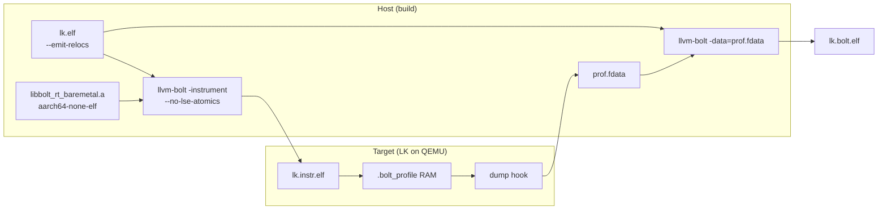

# Architecture

Bare-metal BOLT on LK: overlay patches plus host tooling. Upstream LLVM and LK stay unmodified in `third_party/`; only deltas live in `overlay/`.

For why a post-link optimizer earns its place after PGO and LTO at all, see [why-bolt.md](why-bolt.md).

## Toolchain baseline

| Choice | Value | Why |
|--------|-------|-----|
| LLVM branch | `release/23.x` | `--no-lse-atomics` landed in LLVM 22; 19.x predates it. Phase 3 rebases onto `main`, which is what upstream reviews against. |
| BOLT version | same as LLVM | BOLT is a monorepo subproject with no separate versioning |
| LLVM targets | `X86;AArch64;ARM` | ARM lets clang/lld target AArch32; BOLT itself has no AArch32 backend — that is Phase 3 |
| Assertions | off | Consumed toolchain, not an LLVM debugging build |

## End-to-end flow



## Overlay split

| Layer | Repo path | Upstream target | Responsibility |
|-------|-----------|-----------------|----------------|
| BOLT runtime | `overlay/llvm/patches/` | `bolt/runtime/` | Counters in RAM; no syscalls; cross-built for the target |
| LK platform | `overlay/lk/patches/` | linker scripts, `platform/` | `.bolt_profile` section, dump hook |
| LK workload | `overlay/lk/patches/` | `app/bolt_bench/` (new) | Deterministic hot-path benchmarks |
| AArch32 backend | `overlay/llvm/patches/` | `bolt/lib/Target/` | Phase 3; deleted here as each slice merges upstream |
| Host converter | `scripts/` | — | RAM dump → `.fdata`; never upstreamed |

One patch per logical change, applied by `scripts/apply-overlays.sh`.

Selecting our runtime needs **no BOLT patch** — `llvm-bolt --runtime-instrumentation-lib=` is an existing upstream option. That keeps the Phase 2 overlay to the runtime source plus LK changes.

## Profile data path

Stock BOLT on Linux instruments the binary, updates counters as edges execute, then writes `.fdata` through `open`/`write` at process exit. Bare-metal replaces only the **collection** end:

| # | Component | Change |
|---|-----------|--------|
| 1 | Linker script | Reserve DRAM between `__bolt_profile_start` / `__bolt_profile_end` |
| 2 | Runtime | Update counters in place; serialize into that buffer on demand |
| 3 | Dump + convert | LK exports the region; a host script turns it into `.fdata` |

Re-optimization (`llvm-bolt -data=…`) is untouched.

## What LK is for

LK is a **bare-metal test harness**, not the optimization target.

| Use | Purpose |
|-----|---------|
| Boot smoke test | Instrumentation does not crash; counters tick |
| `bolt_bench` workloads | Known hot loops, memcpy, timer IRQ, thread yield |
| Platform drivers | Optional later: real device paths |

Boot alone is a weak profile — short and cold-cache. Workloads must exercise repeatable hot code so layout changes show up in both counters and measured time. Details in [aarch64-bare-metal.md](aarch64-bare-metal.md).

## AArch64 vs AArch32 scope

| | AArch64 (Phase 2) | AArch32 (Phase 3) |
|---|-------------------|-------------------|
| BOLT backend | Exists upstream | **Does not exist** — the deliverable |
| Bare-metal profile | Overlay runtime + LK | Reuse the same RAM path |
| LK target | `qemu-virt-arm64-test` | `qemu-virt-arm32-test` |
| Upstream goal | Optional runtime contribution | Full ARM/Thumb backend merge |

## Directory map

```
overlay/llvm/patches/   # bare-metal runtime, AArch32 backend slices (staging until upstream merge)
overlay/llvm/tests/     # lit .s fixtures until they move into llvm-project with each PR
overlay/lk/patches/     # linker script, bolt_bench, dump hook
scripts/                # source fetch, build, RunPod, BOLT instrument/optimize
docs/                   # plan + design
third_party/            # llvm-project, lk — gitignored locally; lives on the pod volume
```

## Upstream backend development (Phase 3)

AArch32 BOLT backend code is developed in **`third_party/llvm-project/` on the persistent volume**, not in this overlay repo. Each plan rung (P1–P8) becomes one small llvm-project PR with lit tests under `llvm/test/tools/llvm-bolt/`.

| Step | Where |
|------|--------|
| Branch + implement | `/workspace/bolt-lk-overlay/third_party/llvm-project/` |
| Export staging patch | `overlay/llvm/patches/000N-*.patch` |
| Verify on pod | Rebuild `llvm-bolt`, run lit + LK harness |
| Upstream | PR to `llvm-project/main`; delete overlay patch when merged |

`LLVM_TARGETS_TO_BUILD=ARM` gives clang/lld ARM32 support only. A BOLT backend also requires adding `ARM` to `BOLT_TARGETS_TO_BUILD` and a new `bolt/lib/Target/ARM/` tree. LK/QEMU verification stays in this repo; no LK code goes upstream.
