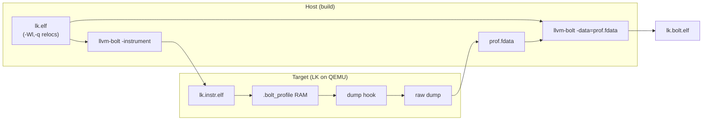

# Architecture

Bare-metal BOLT on LK: overlay patches + host tooling. Upstream LLVM/LK stay unmodified in `third_party/`; only deltas live in `overlay/`.

## End-to-end flow



## Overlay split

| Layer | Repo path | Upstream target | Responsibility |
|-------|-----------|-----------------|----------------|
| BOLT runtime | `overlay/llvm/patches/` | `bolt/runtime/` | Counters in RAM; no Linux syscalls |
| BOLT host (optional) | `overlay/llvm/patches/` | `bolt/` | `--profile-format=raw`, bare-metal flags |
| LK platform | `overlay/lk/patches/` | `project/`, linker scripts | `.bolt_profile` section, dump hook |
| LK workload | `overlay/lk/patches/` | `app/bolt_bench/` (new) | Deterministic hot-path benchmarks |
| Host converter | `scripts/` | — | RAM dump → `.fdata` (not upstream) |

Patches are one file per logical change, applied with `scripts/apply-overlays.sh`.

## Profile data path (bare-metal delta)

Stock BOLT on Linux:

1. Instrument binary embeds `libbolt_rt` hooks.
2. Counters updated on edge execution.
3. At exit, runtime writes **`.fdata`** via `open`/`write` to `/tmp/prof.fdata`.

**Delta for bare-metal** — three new pieces:

| # | Component | Change |
|---|-----------|--------|
| 1 | **Linker script** | Reserve fixed DRAM for counters + metadata (`__bolt_profile_start` / `__bolt_profile_end`) |
| 2 | **bolt-rt overlay** | Write counters in place; optional `bolt_profile_serialize()` into RAM buffer (no FS) |
| 3 | **Dump + convert** | LK dumps region (UART frame / QEMU `dump-guest-memory` / GDB `save`) → host script produces `.fdata` |

Re-optimization (`llvm-bolt -data=…`) is unchanged — only **collection** differs.

## What LK is for

LK is a **bare-metal test harness**, not the optimization goal.

| Use | Purpose |
|-----|---------|
| Boot smoke test | Instrumentation does not crash; counters tick |
| **`bolt_bench` workloads** | Known hot loops, memcpy, timer IRQ, thread yield — measurable speedup |
| Platform drivers | Optional later: real device paths |

Boot time alone is a weak profile (short, cold-cache). Workloads must exercise **repeatable hot code** so layout changes show up in counters and wall-clock.

## AArch64 vs AArch32 scope

| | AArch64 (Phase 2) | AArch32 (Phase 3) |
|---|-------------------|-------------------|
| BOLT backend | Exists upstream | **Does not exist** — new backend |
| Bare-metal profile | Overlay + LK | Reuse same RAM profile path |
| LK target | `qemu-virt-arm64-test` | `qemu-virt-arm32-test` (later) |
| Upstream goal | Optional bolt-rt patch | Full **ARM/Thumb BOLT backend** merge |

See [aarch64-bare-metal.md](aarch64-bare-metal.md) and [aarch32-bolt.md](aarch32-bolt.md).

## Directory map

```
overlay/
├── llvm/patches/          # bolt-rt, ELF32, ARM MCPlusBuilder, tests
└── lk/patches/            # linker script, bolt_bench app, dump hook
docs/
├── PROJECT_PLAN.md        # checklist + status
├── architecture.md        # this file
├── aarch64-bare-metal.md
└── aarch32-bolt.md
scripts/                   # build, RunPod, ram-dump-to-fdata (TBD)
```
