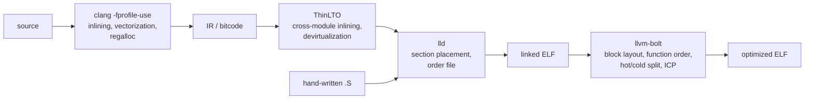

# Why BOLT, on top of PGO and LTO

PGO and LTO reason about **IR**, before the linker assigns addresses. BOLT reasons about the **linked binary**, where the addresses are final. That difference is the whole argument: a handful of optimizations are simply not expressible until layout is fixed, and BOLT is the only stage that sees it.

BOLT is not a replacement for PGO or LTO. It is the stage after them.

## Where each stage acts



Note where `hand-written .S` joins: it bypasses every IR-level stage. Only the linker and BOLT ever see it.

---

## 1. Basic block layout that survives the linker

The compiler orders blocks inside a function, but it must leave cold code reachable and nearby, and it cannot know the final addresses. BOLT inverts branch senses so the hot path falls through, and relocates cold blocks into a separate section.

**Before** — `ERR` is taken 0.1% of the time, yet the hot path takes a branch and the cold body sits in the entry's cache line:

```asm
handle:
        ldr     w1, [x0, #FLAGS]
        tbz     w1, #ERR_BIT, .Lfast   // 99.9% taken
        bl      log_error              // cold, but fetched with the entry
        mov     w0, #-1
        ret
.Lfast:
        b       fast_path
```

**After BOLT:**

```asm
handle:
        ldr     w1, [x0, #FLAGS]
        tbnz    w1, #ERR_BIT, .Lcold   // 0.1% taken; hot path falls through
        b       fast_path
// ... relocated far away, in .text.cold ...
.Lcold:
        bl      log_error
        mov     w0, #-1
        ret
```

The i-cache effect is the real prize:

```
Before — one 64 B line at `handle`:
  [ ldr | tbz | bl log_error | mov | ret | b fast_path ]
     hot   hot  <-- cold, fetched anyway -->     hot

After:
  .text.hot   [ ldr | tbnz | b fast_path | next hot function ... ]
  .text.cold  [ bl log_error | mov | ret ]            never fetched
```

Branch misprediction is the other half. The BOLT paper measured an 11% improvement in that metric on HHVM from block layout alone.

---

## 2. Function ordering across boundaries the LTO unit never sees

ThinLTO can only reorder what it has bitcode for. Static libraries built elsewhere, vendor blobs, and assembly are outside the unit. A linker order file can place functions, but you must name them up front, and it cannot split a function or reach inside a prebuilt archive.

```
Before — a hot call chain spread over three pages, three iTLB entries:

  0x401000   parse()      [a.o]
     ...
  0x412000   emit()       [b.o]
     ...
  0x480000   inflate()    [libz.a — no bitcode, invisible to ThinLTO]

After — BOLT co-locates by measured call frequency:

  0x400000   parse() -> inflate() -> emit()      one 2 MB huge page, one iTLB entry
```

BOLT orders on observed call frequency across the *entire* binary, then optionally maps the hot region onto huge pages.

---

## 3. Profile fidelity: no attribution loss

This one is easy to overlook. Both PGO flavours have to carry a profile *across* a representation change; BOLT does not.

| | Instrumented PGO | AutoFDO (sampled) | BOLT |
|---|---|---|---|
| Profile collected on | an instrumented build | the optimized binary | the exact binary being optimized |
| Mapped through | IR counters → source lines | addresses → debug info → IR | nothing — addresses already match |
| Degrades when | the build drifts from the profile | inlining truncates the inline stack | — |

With AutoFDO, a function inlined into five callers has its samples attributed back through `DW_AT_inline` stacks; truncation smears counts between copies. BOLT sees five distinct copies at five distinct addresses with exact counts, because it profiles the same bytes it rewrites.

---

## 4. Indirect call promotion from observed targets

Devirtualization at the IR level needs type information and whole-program visibility. It gives up on C function pointers, plugin boundaries, and `dlopen`. BOLT just watches which target actually gets called:

```
0x4012a0  ->  uart_read    92%
0x4012a0  ->  spi_read      7%
0x4012a0  ->  <other>       1%
```

**Before:**

```asm
        ldr     x9, [x8, #OPS_READ]
        blr     x9                     // indirect: BTB pressure, opaque to the predictor
```

**After:**

```asm
        ldr     x9, [x8, #OPS_READ]
        adrp    x10, uart_read
        add     x10, x10, :lo12:uart_read
        cmp     x9, x10
        b.ne    .Lfallback
        bl      uart_read              // direct and well predicted in 92% of cases
        b       .Ldone
.Lfallback:
        blr     x9
.Ldone:
```

---

## Where BOLT does *not* help

Worth being blunt, because it bounds the scope of this project:

- **No IR means no IR optimizations.** No vectorization, no register allocation, no algebraic simplification, no source-level inlining decisions. Those belong to PGO and LTO, and BOLT cannot recover them.
- **It needs `--emit-relocs`.** Without relocations in the final binary, BOLT cannot safely move code.
- **It needs a representative profile.** An unrepresentative one can make things slower.
- **Binary size grows**, because hot/cold splitting duplicates and pads.

## Measured gains, on top of PGO and LTO

From the CGO 2019 paper and subsequent reports:

| Workload | Gain | Baseline it was measured against |
|----------|------|----------------------------------|
| Meta data-center binaries | 5.4% average, 8.0% max (HHVM) | PGO function reordering + LTO |
| Clang building itself | ~15% | Clang with LTO + PGO |
| Clang building itself | 7.45% | GCC with PGO |
| Google key workloads | 2–6% | their production builds |

These are gains on binaries that were *already* fully optimized — which is precisely the claim that post-link optimization is complementary rather than redundant.

## Why this matters for LK

LK is small, so the absolute numbers here will be small. That is fine: the deliverable of this project is **capability**, not a benchmark score — in-RAM profiling with no OS underneath, and an AArch32 backend that does not exist upstream at all.

But the mechanisms line up unusually well with firmware:

- **Tiny i-caches.** Cortex-A53 has 32 KB of L1I. Footprint reduction matters proportionally more than it does on a server.
- **IRQ and exception latency** is dominated by short hot paths and branch prediction — exactly what block layout targets.
- **Early boot, vectors, and cache maintenance are hand-written assembly.** PGO and LTO cannot touch a line of it. On a kernel that is a large share of the latency-critical code, and BOLT is the only tool in the chain that can reorder it.

See [aarch64-bare-metal.md](aarch64-bare-metal.md) for how the profile is collected without a filesystem, and [aarch32-bolt.md](aarch32-bolt.md) for the ARM/Thumb work.

## References

- Panchenko et al., *BOLT: A Practical Binary Optimizer for Data Centers and Beyond*, CGO 2019 — [arXiv:1807.06735](https://arxiv.org/abs/1807.06735)
- Auler et al., *Lightning BOLT: Powerful, Fast, and Scalable Binary Optimization*, CC 2021
- [BOLT in the LLVM tree](https://github.com/llvm/llvm-project/tree/main/bolt)
